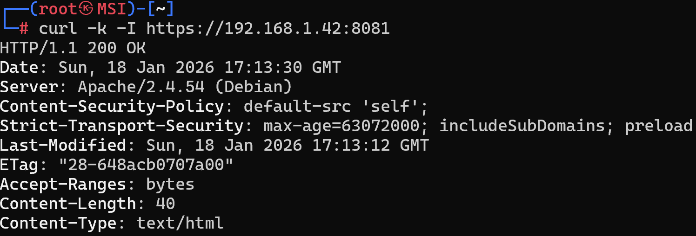

# Práctica 1: Apache Hardening - CSP, HSTS y SSL

## 1. Introducción y Objetivos
El hardening de servidores web consiste en mejorar la seguridad reduciendo vulnerabilidades y puntos de entrada. En esta práctica, se refuerza la seguridad de Apache para reducir la superficie de ataque implementando las siguientes medidas:
* **Desactivación de módulos innecesarios**: Se deshabilita `autoindex` para evitar el listado de directorios.
* **Uso de HTTPS (SSL/TLS)**: Se configura el servidor para cifrar las comunicaciones mediante certificados.
* **Configuración de cabeceras de seguridad**: Implementación de **CSP** y **HSTS** para mitigar ataques como inyecciones y mejorar la integridad.

## 2. Archivos de Configuración

### security-headers.conf
Este archivo define las políticas que el servidor enviará a los navegadores de los clientes.
```apache
<IfModule mod_headers.c>
    # CSP: Solo permite cargar contenido del propio origen
    Header set Content-Security-Policy "default-src 'self';"

    # HSTS: Obliga al navegador a usar siempre HTTPS por seguridad
    Header always set Strict-Transport-Security "max-age=63072000; includeSubDomains; preload"
</IfModule>
```

### Dockerfile
Se utiliza la estrategia de capas solicitada, creando una base segura para las siguientes prácticas.
```dockerfile
FROM php:7.4-apache

# Desactivar autoindex para evitar fugas de información
RUN a2dismod autoindex -f

# Habilitar módulos necesarios para seguridad
RUN a2enmod headers ssl

# Copiar certificados digitales
COPY apache-selfsigned.crt /etc/ssl/certs/
COPY apache-selfsigned.key /etc/ssl/private/

# Aplicar cabeceras y configurar sitio SSL
COPY security-headers.conf /etc/apache2/conf-available/security-headers.conf
RUN a2enconf security-headers

RUN sed -i 's|/etc/ssl/certs/ssl-cert-snakeoil.pem|/etc/ssl/certs/apache-selfsigned.crt|g' /etc/apache2/sites-available/default-ssl.conf && \
    sed -i 's|/etc/ssl/private/ssl-cert-snakeoil.key|/etc/ssl/private/apache-selfsigned.key|g' /etc/apache2/sites-available/default-ssl.conf

RUN a2ensite default-ssl

RUN echo "<h1>Práctica 1: Hardening Base OK</h1>" > /var/www/html/index.html

EXPOSE 80
EXPOSE 443
```

## 3. Instrucciones de Despliegue

1. **Generar el certificado digital**:
   ```bash
   openssl req -x509 -nodes -days 365 -newkey rsa:2048 -keyout apache-selfsigned.key -out apache-selfsigned.crt -subj "/C=ES/ST=Castellon/L=Castellon/O=M4raa/CN=localhost"
   ```

2. **Construir la imagen** (Nomenclatura pps/prX):
   ```bash
   docker build -t m4raa/pps:pr1 .
   ```

3. **Subir a Docker Hub**:
   ```bash
   docker push m4raa/pps:pr1
   ```

4. **Ejecutar el contenedor**:
   ```bash
   docker run --detach --rm -p 8080:80 -p 8081:443 --name="hardenowasp" m4raa/pps:pr1
   ```

## 4. Validación de la Práctica



## 5. URL Docker Hub
Imagen disponible para pull en: [m4raa/pps:pr1](https://hub.docker.com/r/m4raa/pps)