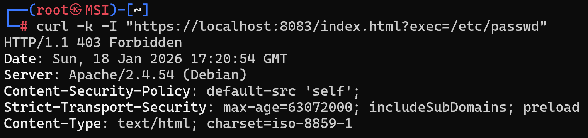

# Práctica 2: Web Application Firewall (ModSecurity)

## 1. Descripción e Introducción
El hardening de Apache incluye el uso de herramientas como **ModSecurity** para proteger el servidor contra ataques de inyección y otras amenazas comunes. En esta práctica se instala y activa este WAF sobre la base segura creada en la práctica anterior.

## 2. Configuración Realizada
* **Estrategia de Capas**: Se utiliza `m4raa/pps:pr1` como imagen base, heredando SSL, CSP, HSTS y la desactivación de autoindex.
* **Activación del WAF**: Se ha instalado `libapache2-mod-security2` y se ha activado el motor de reglas configurando `SecRuleEngine On`.

## 3. Dockerfile
```dockerfile
FROM m4raa/pps:pr1

# Instalar el módulo de seguridad ModSecurity
RUN apt-get update && apt-get install -y libapache2-mod-security2

# Configurar ModSecurity: cambiar de "DetectionOnly" a "On" (activo)
RUN cp /etc/modsecurity/modsecurity.conf-recommended /etc/modsecurity/modsecurity.conf && \
    sed -i 's/SecRuleEngine DetectionOnly/SecRuleEngine On/' /etc/modsecurity/modsecurity.conf
```

## 4. Instrucciones de Despliegue
```bash
# Construcción y subida a Docker Hub
docker build -t m4raa/pps:pr2 .
docker push m4raa/pps:pr2

# Ejecución del contenedor
docker run --detach --rm -p 8082:80 -p 8083:443 --name="waf_container" m4raa/pps:pr2
```

## 5. Validación
Para verificar que el WAF está activo y cargado en Apache:
```bash
curl -k -I "https://localhost:8083/index.html?exec=/etc/passwd"
```


## 6. URL Docker Hub
Imagen disponible para pull en: [m4raa/pps:pr2](https://hub.docker.com/r/m4raa/pps)