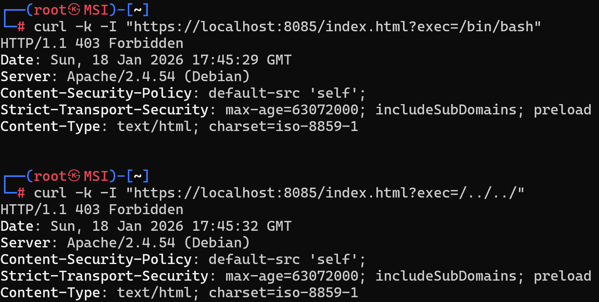

# Práctica 3: Implementación de Reglas OWASP CRS

## Explicación de la Práctica
El hardening de Apache incluye la protección contra ataques de inyección y explotación de vulnerabilidades conocidas[cite: 9, 14]. En esta práctica, se han integrado las reglas del **Core Rule Set (CRS) de OWASP** (SpiderLabs) para filtrar y bloquear peticiones maliciosas que intenten comprometer el servidor.

## Acciones Realizadas
* **Estrategia en cascada**: Esta imagen utiliza `m4raa/pps:pr2` como base.
* **Configuración de Reglas**: Se han clonado las reglas de SpiderLabs y se ha configurado Apache para cargarlas mediante el archivo `security2.conf`.
* **Seguridad Activa**: El motor de ModSecurity ahora utiliza estas reglas para denegar accesos no autorizados.

## Instrucciones de Despliegue
```bash
# Construir la imagen pr3
docker build -t m4raa/pps:pr3 .

# Subir a Docker Hub
docker push m4raa/pps:pr3

# Ejecutar el contenedor
docker run --detach --rm -p 8084:80 -p 8085:443 --name="owasp_container" m4raa/pps:pr3
```

## Validación
Para validar que el WAF con reglas OWASP bloquea ataques de inyección de archivos (LFI):

```bash
curl -k -I "https://localhost:8085/index.html?exec=/bin/bash"
curl -k -I "https://localhost:8085/index.html?exec=/../../"
```

* **Resultado esperado**: `HTTP/1.1 403 Forbidden`.
* **Significado**: Las reglas de OWASP han identificado el intento de acceso a archivos del sistema y han denegado la petición por seguridad.

## Capturas de Pantalla


## URL Docker Hub
[m4raa/pps:pr3](https://hub.docker.com/r/m4raa/pps)