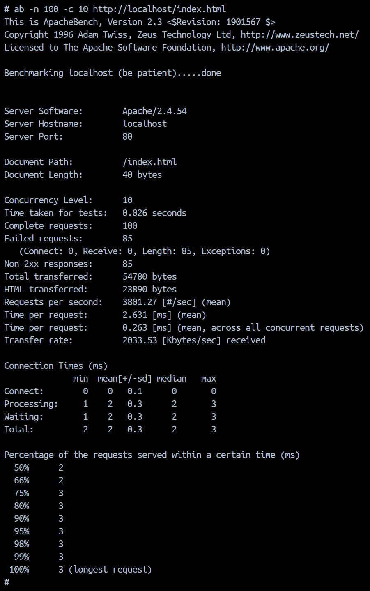

# Práctica 4: Protección contra ataques DDOS (mod_evasive)

## Explicación de la Práctica
El hardening de Apache incluye la prevención de ataques de denegación de servicio (DDoS). En esta práctica se instala el módulo **mod_evasive**, que monitoriza las peticiones entrantes y bloquea temporalmente las direcciones IP que superan los umbrales de tráfico definidos.

## Acciones Realizadas
* **Estrategia en cascada**: Se utiliza `m4raa/pps:pr3` como base, manteniendo el WAF, OWASP y SSL.
* **Configuración de Umbrales**: Se ha configurado `DOSPageCount` y `DOSSiteCount` para detectar ráfagas de peticiones sospechosas.
* **Gestión de Logs**: Se ha creado un directorio específico en `/var/log/mod_evasive` para registrar los bloqueos realizados por el servidor.

## Instrucciones de Despliegue
```bash
# Construir la imagen pr4
docker build -t m4raa/pps:pr4 .

# Subir a Docker Hub
docker push m4raa/pps:pr4

# Ejecutar el contenedor
docker run --detach --rm -p 8086:80 -p 8087:443 --name="ddos_container" m4raa/pps:pr4
```

## Validación
```bash
ab -n 100 -c 5 http://localhost/index.html
```
* **Resultado esperado**: Tras varias peticiones exitosas (200 OK), el servidor debería devolver un **403 Forbidden** (o dejar de responder) indicando que la IP ha sido bloqueada temporalmente.


## URL Docker Hub
[m4raa/pps:pr4](https://hub.docker.com/r/m4raa/pps)