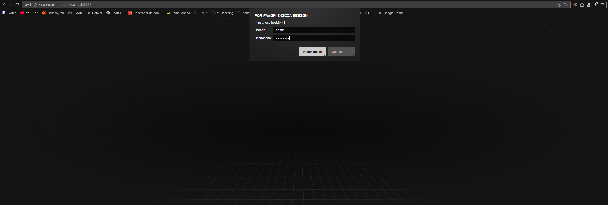
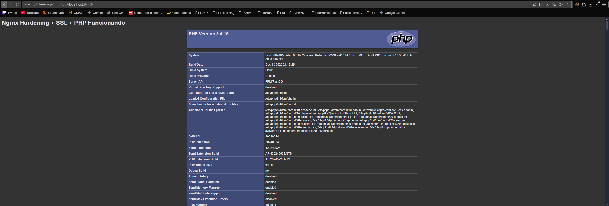

# Práctica 5: Hardening de Servidor Nginx (SSL, Auth y PHP)

## 1. Introducción y Objetivos
Esta práctica tiene como objetivo el despliegue de un servidor **Nginx** endurecido siguiendo las mejores prácticas de seguridad. A diferencia de las prácticas anteriores con Apache, aquí se configura Nginx desde su imagen oficial para implementar cifrado **SSL**, autenticación básica y ocultación de la firma del servidor para prevenir ataques de *fingerprinting*.

## 2. Archivos de Configuración

### A. Dockerfile
El archivo de construcción utiliza la imagen oficial de Nginx. Se encarga de instalar las dependencias necesarias, generar la criptografía del sitio y configurar el acceso restringido.

```dockerfile
# Base basada en Nginx oficial
FROM nginx:latest

USER root

# 1. Instalación de PHP-FPM, OpenSSL y utilidades de Apache para htpasswd
RUN apt-get update && apt-get install -y php-fpm openssl apache2-utils && apt-get clean

# 2. Hardening de cifrado: Generación de certificados SSL de 2048 bits
RUN mkdir -p /etc/nginx/ssl && \
    openssl req -x509 -nodes -days 365 -newkey rsa:2048 \
    -keyout /etc/nginx/ssl/nginx.key \
    -out /etc/nginx/ssl/nginx.crt \
    -subj "/C=ES/ST=Castellon/L=Castellon/O=M4raa/OU=TI/CN=localhost"

# 3. Control de acceso: Creación de usuario 'admin' con clave 'admin'
RUN htpasswd -bc /etc/nginx/.htpasswd admin admin

# 4. Configuración de PHP para escucha TCP en el puerto 9000
RUN sed -i 's|listen = /run/php/php.*-fpm.sock|listen = 127.0.0.1:9000|' /etc/php/*/fpm/pool.d/www.conf

# 5. Despliegue de archivos de configuración y sitio web
COPY default.conf /etc/nginx/conf.d/default.conf
COPY index.php /var/www/html/

RUN chown -R www-data:www-data /var/www/html

EXPOSE 80 443

# 6. Mantenimiento del contenedor: Arranca PHP y mantiene Nginx en primer plano
CMD service $(ls /etc/init.d/ | grep php) start && nginx -g "daemon off;"
```

### B. default.conf
Este archivo define el comportamiento del servidor virtual. Implementa el **Hardening** mediante la desactivación de cabeceras de versión y configura los túneles SSL.

```nginx
server {
    listen 80;
    listen 443 ssl;
    server_name localhost;

    # HARDENING: Desactivar la versión de Nginx en las respuestas HTTP
    server_tokens off;

    # Configuración de Certificados SSL
    ssl_certificate /etc/nginx/ssl/nginx.crt;
    ssl_certificate_key /etc/nginx/ssl/nginx.key;

    # Seguridad de Acceso: Autenticación Básica
    auth_basic "Zona Restringida";
    auth_basic_user_file /etc/nginx/.htpasswd;

    root /var/www/html;
    index index.php index.html;

    location / {
        try_files $uri $uri/ =404;
    }

    # Integración con PHP-FPM vía FastCGI
    location ~ \.php$ {
        include fastcgi_params;
        fastcgi_pass 127.0.0.1:9000;
        fastcgi_param SCRIPT_FILENAME $document_root$fastcgi_script_name;
    }
}
```

## 3. Instrucciones de Despliegue
Para realizar el despliegue completo, ejecute los siguientes comandos en su terminal:

1.  **Construir la imagen**: `docker build -t m4raa/pps:pr5 .`
2.  **Subir a Docker Hub**: `docker push m4raa/pps:pr5`
3.  **Lanzar el servicio**:
    ```bash
    docker run --detach --rm -p 8088:80 -p 8443:443 --name="nginx_harden" m4raa/pps:pr5
    ```


## 4. Validación de la Seguridad




## 5. URL Docker Hub
Imagen disponible en: [m4raa/pps:pr5](https://hub.docker.com/r/m4raa/pps)