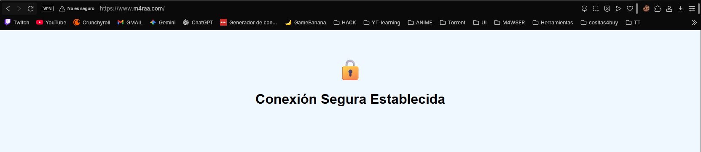

# Práctica 6 - Implementación de SSL en Apache (Docker)

Esta práctica consiste en la securización de un servidor Apache utilizando certificados SSL auto-firmados dentro de un contenedor Docker para el dominio personalizado www.m4raa.com.

## 1. Estructura del Proyecto

El proyecto se compone de los siguientes archivos:
* **m4raa.conf**: Archivo de configuración de Apache para la gestión de tráfico HTTP y HTTPS.
* **Dockerfile**: Script de automatización para la creación de la imagen y generación de certificados.
* **index.html**: Archivo de contenido web para la verificación del servicio.
* **image.png**: Captura de pantalla que valida el funcionamiento del protocolo HTTPS en el navegador.

## 2. Contenido de los Archivos de Configuración

### m4raa.conf
Este archivo define la redirección del puerto 80 al 443 y la configuración del motor SSL para el dominio www.m4raa.com.

```apache
<VirtualHost *:80>
    ServerName www.m4raa.com
    Redirect permanent / https://www.m4raa.com/
</VirtualHost>

<VirtualHost *:443>
    ServerName www.m4raa.com
    DocumentRoot /var/www/html

    SSLEngine on
    SSLCertificateFile /etc/apache2/ssl/apache.crt
    SSLCertificateKeyFile /etc/apache2/ssl/apache.key
    
    <Directory /var/www/html>
        AllowOverride None
        Require all granted
    </Directory>
</VirtualHost>
```

### Dockerfile
El Dockerfile utiliza una imagen base de PHP con Apache, habilita SSL y genera los certificados necesarios de forma automática durante la construcción.

```dockerfile
FROM php:8.2-apache

RUN a2enmod ssl

RUN mkdir -p /etc/apache2/ssl && \
    openssl req -x509 -nodes -days 365 -newkey rsa:2048 \
    -keyout /etc/apache2/ssl/apache.key \
    -out /etc/apache2/ssl/apache.crt \
    -subj "/C=ES/ST=Castellon/L=Castellon/O=M4raa/OU=IT/CN=www.m4raa.com"

COPY m4raa.conf /etc/apache2/sites-available/m4raa.conf
RUN a2dissite 000-default.conf && a2ensite m4raa.conf

COPY index.html /var/www/html/

EXPOSE 80 443
```

### index.html
Contenido básico para mostrar una confirmación visual una vez establecida la conexión segura.

```html
<!DOCTYPE html>
<html lang="es">

<head>
    <meta charset="UTF-8">
    <title>P6 - SSL</title>
    <style>
        body {
            font-family: sans-serif;
            text-align: center;
            padding-top: 50px;
            background-color: #f0f8ff;
        }

        .lock {
            font-size: 50px;
        }
    </style>
</head>

<body>
    <div class="lock">🔒</div>
    <h1>Conexión Segura Establecida</h1>
</body>

</html>
```

## 3. Instrucciones de Despliegue

### Paso 1: Configuración de DNS Local
Añada la siguiente línea al archivo de hosts de su sistema para redirigir el tráfico del dominio a la dirección local:

127.0.0.1 www.m4raa.com

### Paso 2: Construcción de la Imagen
Ejecute el comando para construir la imagen de Docker en el directorio raíz del proyecto:

docker build -t m4raa/pps:pr6 .

### Paso 3: Despliegue del Contenedor
Inicie el servidor mapeando los puertos 80 y 443:

docker run -d -p 80:80 -p 443:443 --name p6-server m4raa/pps:pr6

## 4. Validación de la Práctica

Al navegar a http://www.m4raa.com, el servidor redirigirá automáticamente a https://www.m4raa.com. Se deberá aceptar la excepción de seguridad en el navegador debido a que el certificado es auto-firmado.

La siguiente imagen confirma el acceso exitoso:

