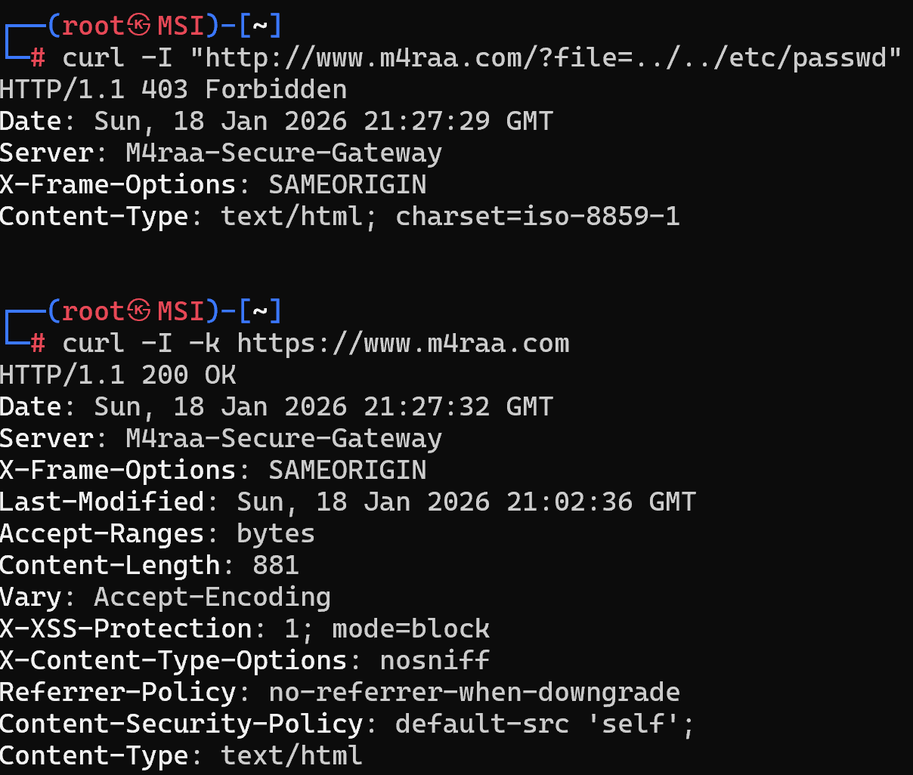

# Práctica 7 - Hardening Avanzado y WAF en Apache

Esta práctica implementa una estrategia de seguridad en profundidad para el dominio www.m4raa.com, integrando directivas de endurecimiento, cabeceras de seguridad modernas y un Firewall de Aplicaciones Web (WAF) mediante ModSecurity.

## 1. Archivos de Configuración

### m4raa.conf
Gestiona los VirtualHosts para tráfico HTTP y HTTPS. Se ha omitido la redirección automática al puerto 443 para permitir que ModSecurity evalúe y bloquee peticiones maliciosas directamente en el puerto 80.

```apache
<VirtualHost *:80>
    ServerName [www.m4raa.com](https://www.m4raa.com)
    DocumentRoot /var/www/html
    <Directory /var/www/html>
        AllowOverride None
        Require all granted
    </Directory>
</VirtualHost>

<VirtualHost *:443>
    ServerName [www.m4raa.com](https://www.m4raa.com)
    DocumentRoot /var/www/html

    SSLEngine on
    SSLCertificateFile /etc/apache2/ssl/apache.crt
    SSLCertificateKeyFile /etc/apache2/ssl/apache.key
    
    <Directory /var/www/html>
        AllowOverride None
        Require all granted
    </Directory>
</VirtualHost>
```

### hardening.conf
Aplica restricciones globales para reducir el footprint del servidor y mitigar ataques de denegación de servicio (DoS) básicos.

```apache
ServerTokens Prod
ServerSignature Off
FileETag None

Timeout 45
KeepAlive On
MaxKeepAliveRequests 100
KeepAliveTimeout 5

<Directory /var/www/html>
    Options -Indexes -Includes -FollowSymLinks
    AllowOverride None
    <LimitExcept GET POST HEAD>
        Require all denied
    </LimitExcept>
</Directory>

TraceEnable Off
```

### modsecurity.conf
Configura el motor de ModSecurity para la detección de intrusiones y personaliza la firma del servidor.

```apache
SecRuleEngine On
SecServerSignature "M4raa-Secure-Gateway"
SecAuditEngine RelevantOnly
SecAuditLog /var/log/apache2/modsec_audit.log
SecAuditLogParts ABIJDEFHZ
SecAuditLogType Serial
SecRequestBodyLimit 13107200
SecRequestBodyNoFilesLimit 131072
SecRequestBodyInMemoryLimit 131072
```

### security-headers.conf
Implementa cabeceras de seguridad para proteger al cliente contra Clickjacking, XSS y ataques de inyección de contenido.

```apache
<IfModule mod_headers.c>
    Header always set X-Frame-Options "SAMEORIGIN"
    Header set X-XSS-Protection "1; mode=block"
    Header set X-Content-Type-Options "nosniff"
    Header set Referrer-Policy "no-referrer-when-downgrade"
    Header set Content-Security-Policy "default-src 'self';"
    Header edit Set-Cookie ^(.*)$ $1;HttpOnly;Secure;SameSite=Strict
</IfModule>
```

### Dockerfile
Automatiza el despliegue instalando el módulo `security2`, generando los certificados SSL necesarios y configurando los permisos del sistema de archivos.

```dockerfile
FROM php:8.2-apache

RUN apt-get update && apt-get install -y \
    libapache2-mod-security2 \
    openssl \
    && apt-get clean

RUN mkdir -p /etc/apache2/ssl && \
    openssl req -x509 -nodes -days 365 -newkey rsa:2048 \
    -keyout /etc/apache2/ssl/apache.key \
    -out /etc/apache2/ssl/apache.crt \
    -subj "/C=ES/ST=Castellon/L=Castellon/O=M4raa/OU=IT/CN=[www.m4raa.com](https://www.m4raa.com)"

COPY m4raa.conf /etc/apache2/sites-available/m4raa.conf
COPY hardening.conf /etc/apache2/conf-available/hardening.conf
COPY security-headers.conf /etc/apache2/conf-available/security-headers.conf
COPY modsecurity.conf /etc/modsecurity/modsecurity.conf

RUN a2enmod headers rewrite unique_id security2 ssl && \
    a2enconf hardening security-headers && \
    a2dissite 000-default.conf && \
    a2ensite m4raa.conf

RUN touch /var/log/apache2/modsec_audit.log && \
    chown www-data:www-data /var/log/apache2/modsec_audit.log

COPY index.html /var/www/html/
RUN chown -R www-data:www-data /var/www/html && \
    chmod -R 755 /var/www/html

EXPOSE 80 443
```

## 2. Instrucciones de Despliegue

1. **DNS Local**: Añadir la entrada `127.0.0.1 www.m4raa.com` en el archivo de hosts del sistema.
2. **Construcción de imagen**: `docker build -t m4raa/pps:pr7 .`
3. **Ejecución del contenedor**: `docker run -d -p 80:80 -p 443:443 --name p7-hardening m4raa/pps:pr7`

## 3. Validación

### Bloqueo de Directory Traversal
Para verificar que el WAF está operativo y bloquea ataques, ejecute:
`curl -I "http://www.m4raa.com/?file=../../etc/passwd"`

El servidor debe responder con un código **403 Forbidden**.

### Inspección de Seguridad
El comando `curl -I -k https://www.m4raa.com` debe confirmar la ocultación de la versión del servidor (`Server: M4raa-Secure-Gateway`) y la presencia de la política CSP.

